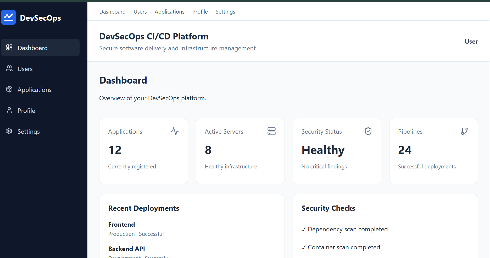
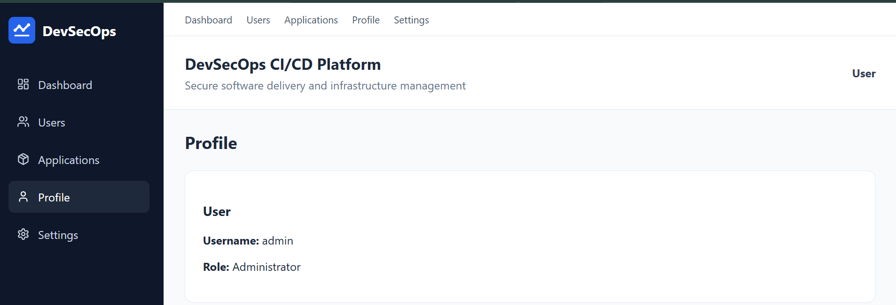
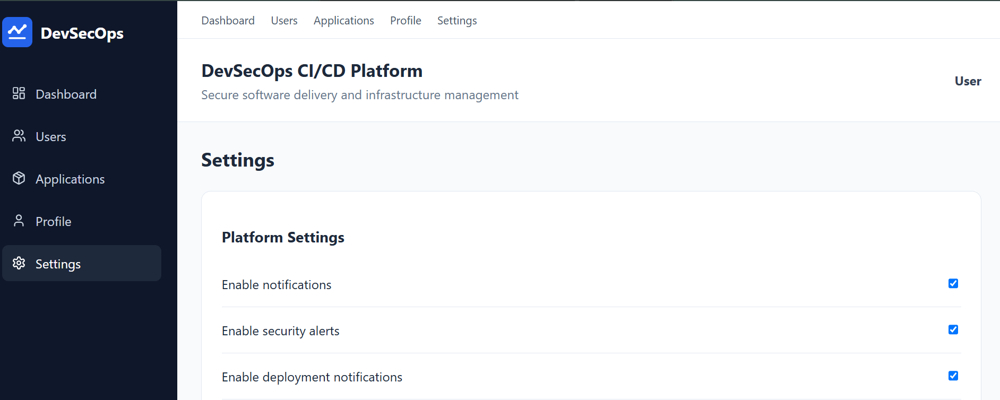
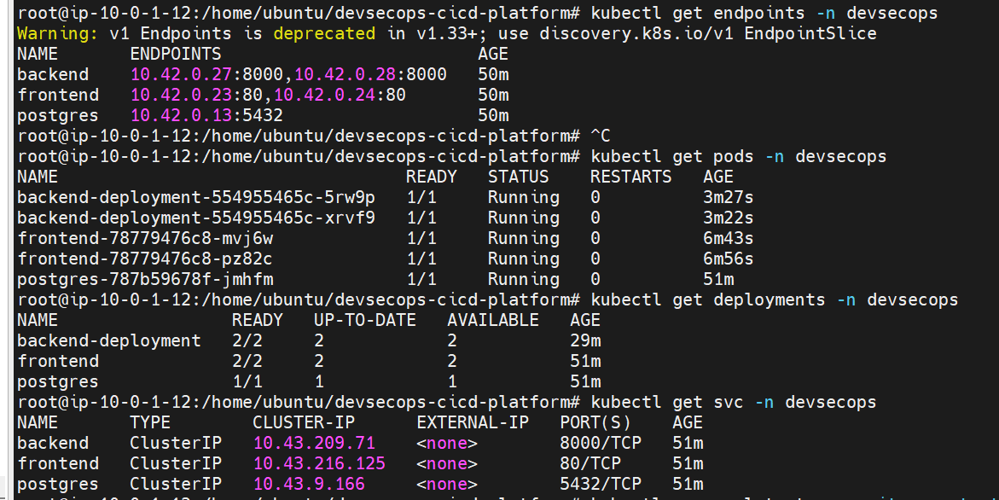
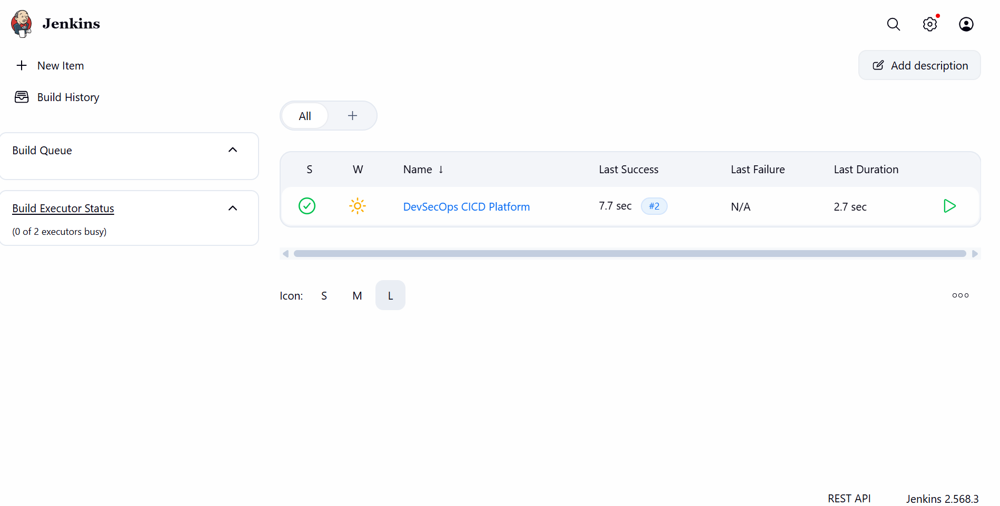

# DevSecOps CI/CD Platform

A complete **DevSecOps CI/CD platform** designed to demonstrate the end-to-end software delivery lifecycle: application development, containerization, orchestration, infrastructure as code, CI/CD automation, security scanning, and monitoring.

> **Project:** `devsecops-cicd-platform`  
> **Repository:** `venujaganti/devsecops-cicd-platform`  
> **Container Runtime:** Podman  
> **Cloud Platform:** AWS

---

## 📌 Project Overview

The DevSecOps CI/CD Platform combines a React frontend, FastAPI backend, PostgreSQL database, Podman containers, Kubernetes deployment, Terraform-based AWS infrastructure, Jenkins CI/CD, GitHub Actions, security scanning, and Prometheus/Grafana monitoring.

The goal is to provide a practical production-style DevSecOps workflow where application code moves through:

```text
Development
    ↓
Git / GitHub
    ↓
CI Validation
    ↓
Security Scanning
    ↓
Container Build
    ↓
Podman
    ↓
Kubernetes
    ↓
AWS Infrastructure
    ↓
Application
    ↓
Monitoring & Alerts
```

---

## 🏗️ Architecture

```text
                         ┌─────────────────────┐
                         │       Developer     │
                         └──────────┬──────────┘
                                    │
                                    ▼
                         ┌─────────────────────┐
                         │       GitHub        │
                         └──────────┬──────────┘
                                    │
                   ┌────────────────┴────────────────┐
                   ▼                                 ▼
          ┌─────────────────┐              ┌─────────────────┐
          │ GitHub Actions  │              │     Jenkins     │
          │ CI / Security   │              │     CI / CD     │
          └────────┬────────┘              └────────┬────────┘
                   │                                │
                   └────────────────┬───────────────┘
                                    ▼
                         ┌─────────────────────┐
                         │ Security Validation │
                         │ Trivy / SonarQube / │
                         │ Dependency Check   │
                         └──────────┬──────────┘
                                    │
                                    ▼
                         ┌─────────────────────┐
                         │       Podman        │
                         │ Frontend / Backend  │
                         └──────────┬──────────┘
                                    │
                                    ▼
                         ┌─────────────────────┐
                         │     Kubernetes      │
                         │ Frontend / Backend  │
                         │ PostgreSQL / Ingress│
                         └──────────┬──────────┘
                                    │
                                    ▼
                         ┌─────────────────────┐
                         │        AWS          │
                         │ Terraform Managed   │
                         │ Infrastructure      │
                         └──────────┬──────────┘
                                    │
                                    ▼
                         ┌─────────────────────┐
                         │ Application Users   │
                         └─────────────────────┘

                  Monitoring
                       │
          ┌────────────┴────────────┐
          ▼                         ▼
     Prometheus                  Grafana
          │
          ▼
     Alertmanager
```

---

## 🧰 Technology Stack

| Area | Technology |
|---|---|
| Frontend | React, Vite |
| Backend | FastAPI, Python |
| Database | PostgreSQL |
| Containerization | Podman, Podman Compose |
| Orchestration | Kubernetes |
| Infrastructure as Code | Terraform |
| Cloud | AWS |
| CI/CD | Jenkins, GitHub Actions |
| Version Control | Git, GitHub |
| Container Security | Trivy |
| Code Quality | SonarQube |
| Dependency Security | OWASP Dependency-Check |
| Monitoring | Prometheus |
| Visualization | Grafana |
| Alerting | Alertmanager |
| Web Server | Nginx |

---

## 📁 Project Structure

```text
devsecops-cicd-platform/
│
├── frontend/
│   ├── public/
│   ├── src/
│   │   ├── assets/
│   │   ├── components/
│   │   ├── context/
│   │   ├── hooks/
│   │   ├── pages/
│   │   └── services/
│   ├── tests/
│   ├── Containerfile
│   ├── nginx.conf
│   ├── package.json
│   ├── package-lock.json
│   └── vite.config.js
│
├── backend/
│   ├── app/
│   │   ├── api/
│   │   ├── database/
│   │   ├── models/
│   │   ├── schemas/
│   │   ├── services/
│   │   ├── config.py
│   │   └── main.py
│   ├── tests/
│   ├── Containerfile
│   ├── requirements.txt
│   └── pytest.ini
│
├── database/
│   ├── init.sql
│   ├── seed.sql
│   └── README.md
│
├── deployment/
│   ├── kubernetes/
│   │   ├── backend/
│   │   ├── frontend/
│   │   ├── postgres/
│   │   ├── configmap.yaml
│   │   ├── secret.yaml
│   │   ├── namespace.yaml
│   │   ├── ingress.yaml
│   │   └── kustomization.yaml
│   │
│   ├── monitoring/
│   │   ├── prometheus/
│   │   ├── grafana/
│   │   └── alertmanager/
│   │
│   └── scripts/
│       ├── deploy.sh
│       ├── health-check.sh
│       └── rollback.sh
│
├── terraform/
│   ├── versions.tf
│   ├── provider.tf
│   ├── variables.tf
│   ├── locals.tf
│   ├── ami.tf
│   ├── vpc.tf
│   ├── security-group.tf
│   ├── ec2.tf
│   ├── user-data.sh
│   ├── outputs.tf
│   └── README.md
│
├── jenkins/
│   ├── install-jenkins.sh
│   ├── install-plugins.sh
│   ├── jenkins.yaml
│   ├── plugins.txt
│   └── README.md
│
├── security/
│   ├── trivy/
│   ├── sonarqube/
│   └── dependency-check/
│
├── monitoring/
│   ├── prometheus/
│   ├── grafana/
│   └── alertmanager/
│
├── tests/
│   ├── integration/
│   ├── smoke/
│   └── security/
│
├── scripts/
│   ├── setup.sh
│   ├── install-tools.sh
│   ├── build-images.sh
│   ├── scan-images.sh
│   ├── deploy.sh
│   ├── verify.sh
│   ├── rollback.sh
│   └── cleanup.sh
│
├── .github/
│   └── workflows/
│       ├── pull-request.yml
│       └── security.yml
│
├── Jenkinsfile
├── podman-compose.yml
├── sonar-project.properties
├── .gitignore
├── .containerignore
├── .env.example
├── README.md
└── LICENSE
```

---

## 🔄 DevSecOps Workflow

### 1. Development

Developers work on the React frontend and FastAPI backend.

### 2. Version Control

Source code is maintained in Git and GitHub.

### 3. Continuous Integration

GitHub Actions and Jenkins validate the application through automated workflows.

### 4. Security

The pipeline integrates:

- Trivy
- SonarQube
- OWASP Dependency-Check

### 5. Containerization

The application is packaged using **Podman**.

Main application containers:

```text
Frontend
Backend
PostgreSQL
```

### 6. Kubernetes

Kubernetes manages:

- Frontend deployment
- Backend deployment
- PostgreSQL
- Services
- ConfigMaps
- Secrets
- Ingress
- Backend HPA

### 7. Infrastructure

Terraform manages the AWS infrastructure.

### 8. Monitoring

The platform uses:

- Prometheus for metrics
- Grafana for visualization
- Alertmanager for alerts

### 9. Testing

The project contains:

- Backend tests
- Frontend tests
- Integration tests
- Smoke tests
- Security tests

---

## 🐳 Podman

This project uses **Podman instead of Docker**.

Build and start the application using the project's Podman Compose configuration:

```bash
podman-compose up -d --build
```

Check running containers:

```bash
podman ps
```

Check logs:

```bash
podman logs <container-name>
```

Stop the application:

```bash
podman-compose down
```

---

## ☸️ Kubernetes

Kubernetes manifests are available under:

```text
deployment/kubernetes/
```

The deployment includes:

```text
Namespace
ConfigMap
Secret
Frontend
Backend
PostgreSQL
Services
Ingress
HPA
Kustomization
```

---

## ☁️ Terraform / AWS

Terraform configuration is available under:

```text
terraform/
```

The infrastructure includes AWS resources required for the project deployment.

Typical Terraform workflow:

```bash
terraform init
terraform validate
terraform plan
terraform apply
```

> Do not commit real AWS credentials, private keys, `.tfstate` files, or sensitive environment values.

---

## 🔐 Security

Security tooling is organized under:

```text
security/
```

### Trivy

Used for container and filesystem vulnerability scanning.

### SonarQube

Used for code-quality and static-analysis checks.

### OWASP Dependency-Check

Used to identify vulnerable third-party dependencies.

---

## 📊 Monitoring

Monitoring configuration is available in:

```text
monitoring/
deployment/monitoring/
```

### Prometheus

Collects application and infrastructure metrics.

### Grafana

Provides dashboards and visualization.

### Alertmanager

Handles Prometheus alerts.

---

# 📸 Screenshots

The following section is intentionally included so deployment and project screenshots can be added to the GitHub README.

> **Recommended:** Upload screenshots to the GitHub repository/README using GitHub's image upload feature. This avoids changing the locked project folder structure.

## 1. Application Login

**Screenshot:** Login page


## 2. Application Dashboard

**Screenshot:** Main dashboard after successful login



## 3. Users Page

**Screenshot:** Users management page


### 4. Profile



### 5. Settings




## 6. Podman Containers

**Screenshot:** Running application containers using `podman ps`


## 7. Kubernetes

**Screenshot:** Kubernetes pods/services/deployments



## 8. Jenkins Pipeline

**Screenshot:** Jenkins pipeline



### 9. Jenkins Pipeline Stages


---

## 🧪 Testing

Backend tests:

```text
backend/tests/
```

Frontend tests:

```text
frontend/tests/
```

Integration tests:

```text
tests/integration/
```

Smoke tests:

```text
tests/smoke/
```

Security tests:

```text
tests/security/
```

---

## 🔑 Demo Login

For local/demo usage:

```text
Username: admin
Password: admin
```

> Change demo credentials and the application's `SECRET_KEY` before production use.

---

## 📋 Project Phases

| Phase | Description | Status |
|---|---|---|
| 1 | Project Foundation | Completed / In Progress |
| 2 | Frontend | Completed / In Progress |
| 3 | Backend | Completed / In Progress |
| 4 | Database | Completed / In Progress |
| 5 | Podman Containerization | Completed / In Progress |
| 6 | Kubernetes | Completed / In Progress |
| 7 | Terraform / AWS | Completed / In Progress |
| 8 | Jenkins CI/CD | Completed / In Progress |
| 9 | GitHub Actions | Completed / In Progress |
| 10 | DevSecOps Security | Completed / In Progress |
| 11 | Monitoring | Completed / In Progress |
| 12 | Testing | Completed / In Progress |

---

## 🎯 Project Objectives

- Build a complete DevSecOps application platform.
- Automate application delivery.
- Containerize applications using Podman.
- Deploy applications with Kubernetes.
- Provision AWS infrastructure using Terraform.
- Implement Jenkins CI/CD.
- Implement GitHub Actions workflows.
- Integrate security scanning into CI/CD.
- Monitor applications using Prometheus and Grafana.
- Implement automated testing and deployment validation.

---

## ⚠️ Security Notes

Never commit:

```text
.env
*.pem
*.key
terraform.tfstate
terraform.tfstate.*
AWS access keys
AWS secret keys
database passwords
JWT secrets
production credentials
```

Use environment variables, AWS IAM, Kubernetes Secrets, or another secure secret-management mechanism for sensitive values.

---

## 👨‍💻 Author

**Venu Jaganti**

GitHub:

`https://github.com/venujaganti`

Project:

`https://github.com/venujaganti/devsecops-cicd-platform`

---

## 📄 License

This project is provided for educational and portfolio purposes.
